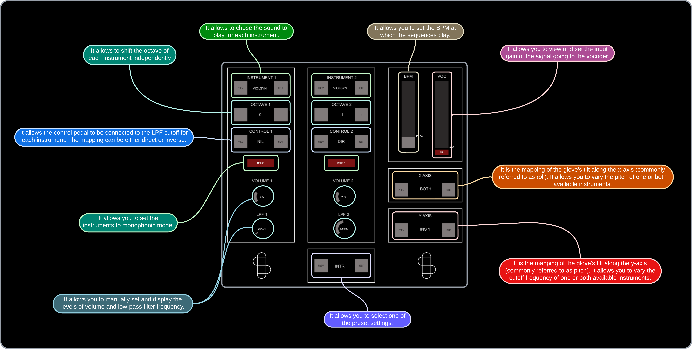
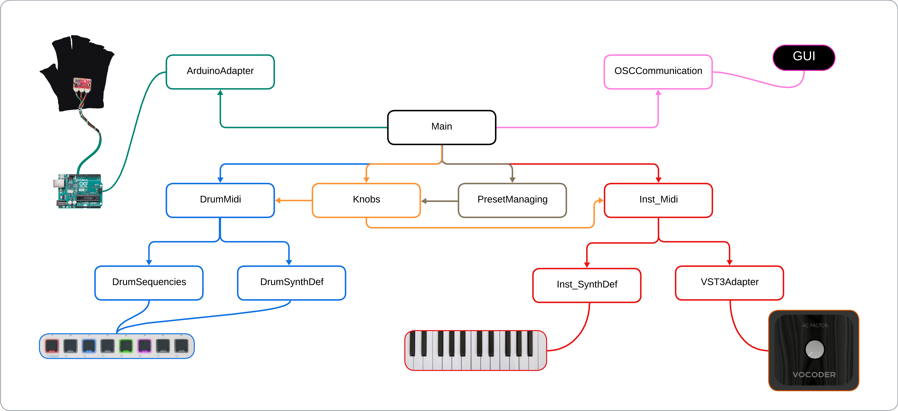
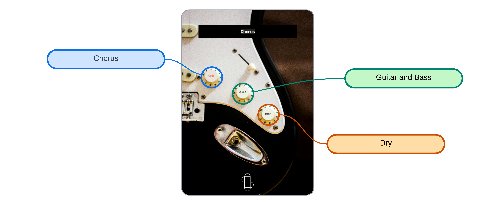

# ANSAL CMLS PROJECT

## Summary of the functionalities
The aim of our project is to provide small groups of musicians with a comprehensive tool to expand their musical possibilities and perform as if they were a full band. To achieve this, we have implemented the following modules:
1. **Polyphonic MIDI Phase Vocoder (JUCE)**: This allows for the simulation of vocal harmonies, enriching the musical landscape.
2. **Polyphonic Synthesizer**: Features numerous functionalities including mono mode, keyboard split, low-pass filter (LPF), octave shift, pitch shift, and drum sequences, which will be detailed later. Note: These two instruments are interconnected. The Vocoder is accessible via the Synth interface, and the notes received by the Synth are forwarded to the Vocoder. This setup enables a single person to play both instruments effortlessly.
3. **Guitar Effects Suite**: Uses pitch recognition to identify the fundamental notes of the chords being played. This allows processing that note, with or without synthetic sounds and harmonizations, enabling a single guitarist to "play two guitars" or a "guitar and a bass."

The functionalities of the modules can be modified either through the graphical interface or via MIDI command mappings, as will be illustrated later.

## Index
1. [Vocoder Module](#vocoder-module)
2. [Synth Module](#synth-module)
   1. [Synth Hardware Configuration](#synth-hardware-configuration)
   2. [Synthesizer Features](#synthesizer-features)
      1. [Sound Patch Details](#sound-patch-details)
      2. [Presets Details](#presets-details)
   3. [Implementation Details](#implementation-details)
   4. [Interaction with Accelerometer and Arduino](#interaction-with-accelerometer-and-arduino)
   5. [Communication between SuperCollider and Processing](#communication-between-supercollider-and-processing)
      1. [Processing](#processing)
      2. [SuperCollider](#supercollider)
3. [Guitar Module](#guitar-module)

## 1. Vocoder Module 

The polyphonic vocoder implemented in this project is a K-voice polyphonic vocoder (where K is a parameter that can be easily modified in the private variables in PluginProcessor) controlled via MIDI.

The operation is as follows:

1. **Audio Input**: The audio enters through the microphone input into the PluginProcessor. Here, it is normalized (using the SimpleCompressor class) to ensure a stable input signal level.
2. **Audio and MIDI Processing**: The processBlock reads the incoming audio buffer and MIDI input. For each MIDI note read, it activates one of the K voices and assigns it to process the audio buffer at the specific MIDI note frequency.
3. **Voice Processing**: Each vocoder voice (PhaseVoc class) processes the audio buffer using the following "leaky autocorrelation" formula:

$$ R_{l,n} = (1 - k) R_{l,n-1} + k x_n x_{n-l} $$

Where: 
- **$R_{l,n}$**: Leaky autocorrelation at lag $l$ and time $n$.
- **$R_{l,n-1}$**: Leaky autocorrelation at lag $l$ and previous time step $n-1$.
- **$x_n$**: Input signal at time $n$.
- **$x_{n-l}$**: Input signal $l$ steps before $n$.
- **$k$**: Leakiness constant, typically around $0.001$.

This formula balances past autocorrelation values with new data, allowing the vocoder to adapt to changes in the speech signal over time.

4. **Envelope Application**: To ensure the notes have a pleasant envelope, PhaseVoc applies methods from the EnvelopeGenerator class to the processed audio. Once this is done, it returns the buffer containing the processed result to PluginProcessor.
5. **High-Pass Filtering**: Before outputting the audio, PluginProcessor applies a High-Pass Filter (HighPassFilter class) to the outgoing audio to remove the lowest frequencies and enhance audio intelligibility if necessary.

The following steps and the class hierarchy related to audio processing are easily deducible from the following diagram:

## 2. Synth Module 

The synth module includes numerous functions available to the user, all controllable via both the graphical interface and MIDI. Additionally, the Vocoder described in the previous section is integrated within the Synth module. This setup ensures that the MIDI notes used to play the synthesizer are also forwarded to the Vocoder, allowing it to modulate the voice with the same harmonies.

### 2.1 Synth Hardware Configuration 
The hardware setup for the synth module is as follows:
#### MIDI Input Devices
You can modify and control the system parameters using various MIDI controllers (details on how this is achieved will be provided in subsequent sections). The devices include:
* MIDI keyboard (Arturia Minilab configured with [this preset](ReadmeFiles/MIDIMapConfig.minilabmk2)).
* Sustain pedal.
* Volume control pedal (not used for volume control).
* Analog control pedal to MIDI signal adapter (I used [this one](https://beatbars.com/en/dual-to-midi.html)).

#### Hand Inclination Input
The system also takes input from the hand inclination of the keyboardist. The reason and method for using this to aid in system control will be explained later. The necessary hardware devices are:
* Accelerometer: Mounted on a glove to be worn while playing (I used [this one](https://wiki.dfrobot.com/Triple_Axis_Accelerometer_MMA7361_SKU_DFR0143)).
* Arduino Uno: Required to derive angle data from the accelerometer coordinates and interface the accelerometer with the system.

The system components are connected as illustrated in the figure below:

### 2.2 Synthesizer Features 
The synthesizer offers extensive configuration and parameter customization options. The list of functionalities is detailed in the GUI picture at the beginning of the Synth chapter and in the MIDI mapping diagram provided below, so for brevity, I will not re-list them here.

Instead, in the following two paragraphs, I will focus on describing the sounds available in the synth and how the settings and sounds can be combined to create interesting presets.

#### 2.2.1 Sound Patch Details 

Within the synth, various types of sounds are available for each of the two instruments, enhancing the versatility of sound customization. Below are the unique features of each sound patch:

* **Rhodes:** *RHODES1* and *RHODES2* emulate the classic Rhodes electric piano using pulse waves to create a rich harmonic spectrum. **RHODES1** provides a warm, lush sound with an ADSR envelope and a dynamically shifting low-pass filter, enhanced by a chorus effect, making it perfect for chordal textures. **RHODES2** offers an alternative Rhodes sound with a faster attack, enhanced chorus with a longer delay, and added reverb, creating a spacious, immersive sound ideal for both pads and expressive leads.

* **Bass Synths:** *BASSYN1, BASSYN2, BASSYN3, and BASSIMP* cover a broad range of bass sounds. **BASSYN1** uses LFOs to modulate pulse width and rate, resulting in a dynamic, evolving sound with automated panning, suitable for electronic and pop styles. **BASSYN2** features slightly detuned sawtooth oscillators combined with a sub oscillator for a deep, powerful bass sound, with vibrato adding realism and a low-pass filter ensuring punchiness and clarity. **BASSYN3** enhances this design with chorus and light distortion, adding character to the sawtooth and sub oscillator combination, ideal for standout bass lines. **BASSIMP** focuses on simplicity with a single sawtooth oscillator, vibrato, and a low-pass filter, offering a clean, solid bass tone perfect for no-frills bass lines.

* **Lead and Wave Synths:** *LEADSCR, TRIWAVE, and SAWWAVE* are designed for a variety of uses, from lead lines to pads and bass. **LEADSCR** is crafted for powerful, cutting lead sounds with a sync sawtooth oscillator and dynamic frequency modulation, with the filter's cutoff and resonance modulated by envelopes for added expressiveness. **TRIWAVE** generates a triangle wave with added distortion, providing a distinctive tone controlled by a low-pass filter and ADSR envelope, great for smooth, warm leads or pads with a touch of grit. **SAWWAVE** produces a classic sawtooth wave known for its bright, rich harmonic content, with a low-pass filter and ADSR envelope offering control over timbre and dynamics, making it versatile for leads, pads, and bass lines.

#### 2.2.2 Presets Details 

* **Mono Bass, Drum, and Synth**: By activating keyboard split, applying a bass (octave shift -1) on the left section and another synth on the right section, you can simultaneously play a bass and a synth. The mono setting on the left side allows you to not worry about the sustain pedal release, enabling the pianist to focus on coordinating the pedal with only the right hand. Adding a drum sequence, mapping the synth's right-hand cut-off frequency with the glove or pedal, creates a very interesting effect [(video demonstration)](https://youtube.com/shorts/gCrn4zHpHQo).

* **Theremin-like Setup**: Activating glove pitch bend mapping for both instruments and connecting the glove's y-control to the cut-off frequency of the higher synth and the control pedal to the cut-off frequency of the lower synth (-1 octave shift) produces unique results [(video demonstration)](https://youtube.com/shorts/tryA1LliBas?feature=share).

* **Deep Synth**: Using settings similar to the first preset on the list but removing the keyboard split, you can achieve [this type of effect](https://youtube.com/shorts/acOKHua5lS0?feature=share).

**Note**: The *Keyboard Split* can be activated/deactivated as follows:

* By clicking on knob 1 (top left on the Arturia), the "split selection" mode is activated. In this mode, the system waits for you to press a note. Once done, that note becomes the split point between the left and right sections of the keyboard.
* To remove the keyboard split, press knob 1 again. Now, both instruments will play simultaneously across the entire keyboard range.

### 2.3 Implementation Details 
To implement the system, we aimed to separate functionalities into distinct modules and files as much as possible. This approach ensures independent operation, improving maintainability and code reusability. As shown in the diagram below:

* **Blue Modules**: Manage the rhythmic section, handling MIDI inputs, defining the sounds to be played, and setting up percussion sequences.
* **Red Modules**: Handle MIDI note management, including processing MIDI note inputs, defining the synth sounds, and forwarding notes to the vocoder.
* **Orange and Gray Sections**: Represent the management of knobs and presets. When a user selects a new preset, the knobs module updates all "knob values" (system parameters), which then propagate to all other modules. Additionally, the knobs module handles MIDI CC inputs.
* **Green Module**: ArduinoAdapter module, which receives hand inclination values and applies them to the system.
* **Pink Module**: OSCCommunication module, responsible for receiving user mouse inputs and refreshing the GUI to display the system status on the screen.

### 2.4 Interaction with Accelerometer and Arduino 

Regarding the implementation of the glove, the input management is almost entirely handled in SuperCollider. However, the data received in SuperCollider is not the raw 3-axis accelerometer data. The accelerometer detects acceleration along the three Cartesian axes, whereas SuperCollider receives acceleration relative to the hand's orientation. To perform this conversion, we used formulas typically employed for managing drone orientation in the air ([source](https://atadiat.com/en/e-towards-understanding-imu-basics-of-accelerometer-and-gyroscope-sensors/)).

### 2.5 Communication between SuperCollider and Processing 

Processing creates a graphical user interface (GUI) that allows users to control musical parameters, which are sent to SuperCollider via the Open Sound Control (OSC) protocol. SuperCollider processes these inputs to produce audio and can send updates back to Processing for dynamic GUI adjustments.

This interaction is illustrated in the diagram below:

Below, we outline the roles of SuperCollider and Processing in managing the GUI and their communication methods.

#### 2.5.1 Processing 
Processing generates the GUI, including buttons, sliders, and knobs for controlling parameters such as volume, low-pass filters (LPF), instrument selection, octaves, control pedals, and presets. Excluding initialization and support functions, the code can be grouped into the following main sections:

* **Communication Management with SuperCollider:**
   * *Sending OSC Messages*: The code handles sending OSC messages to SuperCollider to communicate various parameters. Functions send the names of selected instruments, control parameters such as mono status, volume, low-pass filter (LPF) frequency, BPM, vocoder volume, and the state of the graphical user interface (GUI). Additionally, they send selected octaves and accelerometer values.
   * *Receiving OSC Messages*: When OSC messages are received from SuperCollider, the graphical interface updates accordingly. This includes updating knobs, sliders, and labels with received values and control statuses, such as the mono and GUI buttons.

* **User Input Management:** The graphical interface allows users to interact with various controls. Buttons enable changing instruments, octaves, control pedal settings, accelerometers, and presets. Each button has a listener that changes its background color and sends an OSC message to SuperCollider. Sliders and knobs allow adjusting parameters such as BPM, vocoder volume, overall volume, and filter frequencies, sending the selected values to SuperCollider when modified.

* **GUI Update:** The code graphically updates the user interface in each frame, drawing shapes and logos on the GUI window.

#### 2.5.2 SuperCollider 
In SuperCollider, we can also divide communication management into main sections:

* **Receiving OSC Messages:** The code handles receiving OSC messages from Processing via OSCdef, which defines various handlers to process the received messages. These handlers update corresponding variables based on the messages received. They manage different aspects such as instrument selection, mono control, volume, low-pass filter, drum sequence BPM, octave selection, vocoder management, control pedal and glove mapping, and preset selection.

* **Sending OSC Messages:** The ~updateGUI function sends OSC messages to Processing to keep the GUI updated. This function sends information about instrument volumes, low-pass filter cut-off frequencies, selected preset, selected instruments, mono status, drum sequence BPM, current glove status, vocoder volume, vocoder editor status, control pedal mapping, and selected octaves.

* **GUI Update Routine:** The ~guiRoutine ensures that the GUI is always synchronized with the current parameter states by executing the ~updateGUI function every 0.1 seconds.

## 3. Guitar Module 

