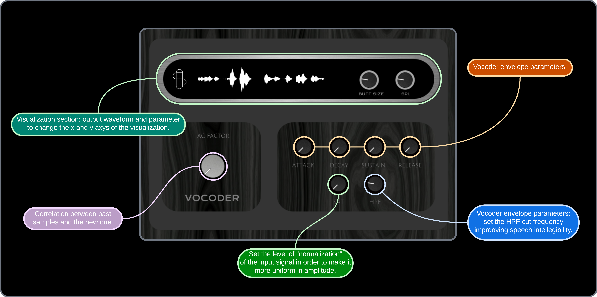
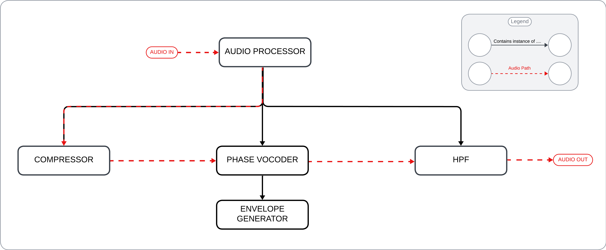
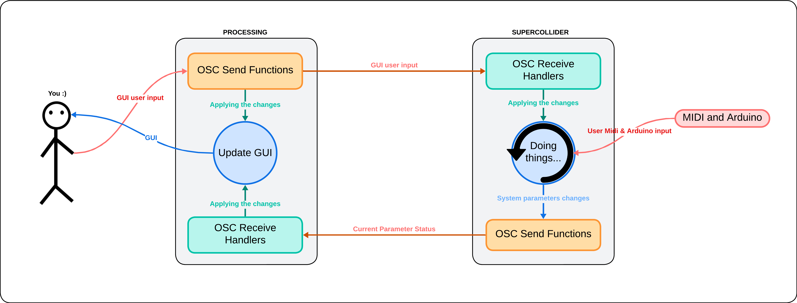

# ANSAL CMLS PROJECT
## Summary of the functionalities
The aim of our project is to provide small groups of musicians with a comprehensive tool to expand their musical possibilities and perform as if they were a full band. To achieve this, we have implemented the following modules:
1. **Polyphonic MIDI Phase Vocoder (JUCE)**: This allows for the simulation of vocal harmonies, enriching the musical landscape.
2. **Polyphonic Synthesizer**: Features numerous functionalities including mono mode, keyboard split, low-pass filter (LPF), octave shift, pitch shift, and drum sequences, which will be detailed later.
   Note: These two instruments are interconnected. The Vocoder is accessible via the Synth interface, and the notes received by the Synth are forwarded to the Vocoder. This setup enables a single person to play both instruments effortlessly.
3. **Guitar Effects Suite**: Uses pitch recognition to identify the fundamental notes of the chords being played. This allows to process that note, with or without syntetic sounds and or harmonizations, enabling a single guitarist to "play two guitars" or a "guitar and a bass."

The functionalities of the modules can be modified either through the graphical interface or via MIDI command mappings, as will be illustrated later.

# Vocoder Module

The polyphonic vocoder implemented in this project is a K-voice polyphonic vocoder (where K is a parameter that can be easily modified in the private variables in PluginProcessor) controlled via MIDI.

 The operation is as follows:

1. **Audio Input**: The audio enters through the microphone input into the PluginProcessor. Here, it is normalized (using the SimpleCompressor class) to ensure a stable input signal level.
2. **Audio and MIDI Processing**: The processBlock reads the incoming audio buffer and MIDI input. For each MIDI note read, it activates one of the K voices and assigns it to process the audio buffer at the specific MIDI note frequency.
3. **Voice Processing**: Each vocoder voice (PhaseVoc class) processes the audio buffer using the following "leaky autocorrelation" formula:

$$ R_{l,n} = (1 - k) R_{l,n-1} + k x_n x_{n-l} $$

   Where: 
   - **$R_{l,n}$**: Leaky autocorrelation at lag $l$ and time $n$.
   - **$R_{l,n-1}$**: Leaky autocorrelation at lag $l$ and previous time step $n-1$.
   - **$x_n$**: Input signal at time $n$.
   - **$x_{n-l}$**: Input signal $l$ steps before $n$.
   - **$k$**: Leakiness constant, typically around $0.001$.

  This formula balances past autocorrelation values with new data, allowing the vocoder to adapt to changes in the speech signal over time.

4. **Envelope Application**: To ensure the notes have a pleasant envelope, PhaseVoc applies methods from the EnvelopeGenerator class to the processed audio. Once this is done, it returns the buffer containing the processed result to PluginProcessor.
5. **High-Pass Filtering**: Before outputting the audio, PluginProcessor applies a High-Pass Filter (HighPassFilter class) to the outgoing audio to remove the lowest frequencies and enhance audio intelligibility if necessary.

The following steps and the class hierarchy related to audio processing are easily deducible from the following diagram:

# Synth Module

The synth module includes numerous functions available to the user, all controllable via both the graphical interface and MIDI. Additionally, the Vocoder described in the previous section is integrated within the Synth module. This setup ensures that the MIDI notes used to play the synthesizer are also forwarded to the Vocoder, allowing it to modulate the voice with the same harmonies.

## Synth Hardware Configuration
The hardware setup for the synth module is as follows:
### MIDI Input Devices
You can modify and control the system parameters using various MIDI controllers (details on how this is achieved will be provided in subsequent sections). The devices include:
* MIDI keyboard (Arturia Minilab configured with [this preset](ReadmeFiles/MIDIMapConfig.minilabmk2)).
* Sustain pedal.
* Volume control pedal (not used for volume control).
* Analog control pedal to MIDI signal adapter (I used [this one](https://beatbars.com/en/dual-to-midi.html)).
### Hand Inclination Input
The system also takes input from the hand inclination of the keyboardist. The reason and method for using this to aid in system control will be explained later. The necessary hardware devices are:
* Accelerometer: Mounted on a glove to be worn while playing (I used [this one](https://wiki.dfrobot.com/Triple_Axis_Accelerometer_MMA7361_SKU_DFR0143)).
* Arduino Uno: Required to derive angle data from the accelerometer coordinates and interface the accelerometer with the system.

The system components are connected as illustrated in the figure below:

## Synthesizer Features
The synthesizer offers extensive configuration and parameter customization options. The list of functionalities is detailed in the GUI picture at the beginning of the Synth chapter and in MIDI mapping diagram provided below, so for brevity, I will not re-list them here.

Instead, I will focus on some interesting setting combinations, along with a video demonstration for each:

* **Mono Bass, Drum, and Synth**: By activating keyboard split, applying a bass (octave shift -1) on the left section and another synth on the right section, you can simultaneously play a bass and a synth. The mono setting on the left side allows you to not worry about the sustain pedal release, enabling the pianist to focus on coordinating the pedal with only the right hand. Adding a drum sequence, mapping the synth's right-hand cut-off frequency with the glove or pedal, creates a very interesting effect (video demonstration).

* **Theremin-like Setup**: Activating glove pitch bend mapping for both instruments and connecting the glove's y-control to the cut-off frequency of the higher synth and the control pedal to the cut-off frequency of the lower synth (-1 octave shift) produces unique results (video demonstration).

* **Synth and Drum**: Using settings similar to the first preset on the list but removing the keyboard split, you can achieve this type of effect.

**Note**: The *Keyboard Split* can be activated/deactivated as follows:

* By clicking on knob 1 (top left on the Arturia), the "split selection" mode is activated. In this mode, the system waits for you to press a note. Once done, that note becomes the split point between the left and right sections of the keyboard.
* To remove the keyboard split, press knob 1 again. Now, both instruments will play simultaneously across the entire keyboard range.

## Implementation Details

To implement the system, we aimed to separate functionalities into distinct modules and files as much as possible. This approach ensures independent operation, improving maintainability and code reusability. As shown in the diagram below:

* **Blue Modules**: Manage the rhythmic section, handling MIDI inputs, defining the sounds to be played, and setting up percussion sequences.
* **Red Modules**: Handle MIDI note management, including processing MIDI note inputs, defining the synth sounds, and forwarding notes to the vocoder.
* **Orange and Gray Sections**: Represent the management of knobs and presets. When a user selects a new preset, the knobs module updates all "knob values" (system parameters), which then propagate to all other modules. Additionally, the knobs module handles MIDI CC inputs.
* **Green Module**: ArduinoAdapter module, which receives hand inclination values and applies them to the system.
* **Pink Module**: OSCCommunication module, responsible for receiving user mouse inputs and refreshing the GUI to display the system status on the screen.

## Synth Module GUI
The Processing code creates a graphical user interface (GUI) that allows users to control various musical parameters. These parameters are sent to SuperCollider using the Open Sound Control (OSC) protocol. SuperCollider processes these parameters to produce the corresponding audio output and can send updates back to Processing to dynamically adjust the GUI.

### Processing
The Processing code is responsible for creating the GUI, which includes buttons, sliders, and knobs for controlling various musical parameters such as volume, low-pass filters (LPF), instrument selection, octaves, control pedals, and presets. When a user interacts with the GUI components, OSC messages are sent to SuperCollider to update the corresponding musical parameters. The functions are shown [here](ReadmeFiles/ProcessingFunctions.txt).

#### OSC Communication
The oscEvent(OscMessage theOscMessage) function handles the reception of OSC messages from SuperCollider. When an OSC message is received, the GUI components are updated accordingly.

### SuperCollider
The SuperCollider code manages the reception and processing of OSC messages sent from the Processing GUI. It also sends OSC messages back to Processing to update the GUI based on the current state of the audio parameters.

The ~updateGUI function sends OSC messages to Processing to update the GUI with the current values of audio parameters. This function is periodically executed by the ~guiRoutine to ensure the GUI remains synchronized with the audio processing state.

### Routine
The ~guiRoutine is a loop that calls ~updateGUI every 0.1 seconds to send updates to the Processing GUI. This ensures that all parameter changes in SuperCollider are reflected in the GUI.

# Guitar Module

